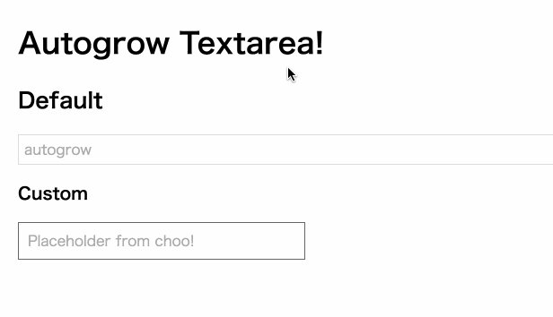

# autogrow



## Usage

```js
var autogrow = require('yo-yo-autogrow')

var el = yo`<div>
  ${autogrow()}
</div>`
```

### Properties

```js
autogrow({
  value: 'init value',
  placeholder: 'overwrite placeholder'
})
```

### Style

| Property | Default |
| :-- | :-- |
| `--AutogrowTextarea-border` | `1px solid #ddd` |
| `--AutogrowTextarea-border-focus` | `1px solid #9cc` |
| `--AutogrowTextarea-width` | `100%` |
| `--AutogrowTextarea-padding` | `4px 6px` |
