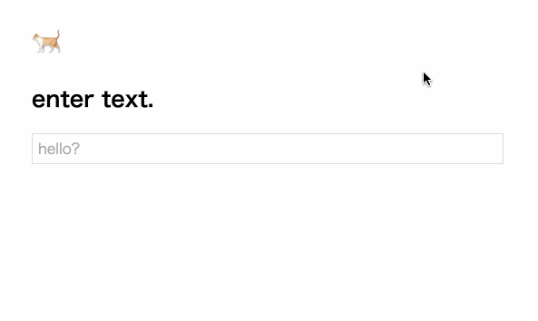

# autogrow

Wrapper `<textarea />` UI Component made from [yo-yo](https://github.com/maxogden/yo-yo)



## Usage

```js
const autogrow = require('yo-yo-autogrow')

const el = yo`<div>
  ${autogrow({
    required: true,
    placeholder: 'enter...'
  })}
</div>`
```

with [Choo](https://github.com/yoshuawuyts/choo)

```js
const choo = require('choo')
const html = require('choo/html')
const autogrow = require('yo-yo-autogrow')

const app = choo()

app.model({
  state: {title: 'Sample with choo'}
})

const mainView = (state) => html`
  <main>
    <div>
      <h1>${state.title}</h1>
      <form>
        ${autogrow()}
      </form>
    </div>
  </main>
`

document.body.appendChild(tree)
```


### Properties

| Property | Default |
| :-- | :-- |
| placeholder | `''` |
| value | `''` |
| name | `''` |
| disabled | `false` |
| required | `false` |
| inputmode | `''` |
| autocomplete | `'off'` |

### Style

| Property | Default |
| :-- | :-- |
| `--AutogrowTextarea-border` | `1px solid #ddd` |
| `--AutogrowTextarea-border-focus` | `1px solid #9cc` |
| `--AutogrowTextarea-width` | `100%` |
| `--AutogrowTextarea-padding` | `4px 6px` |
